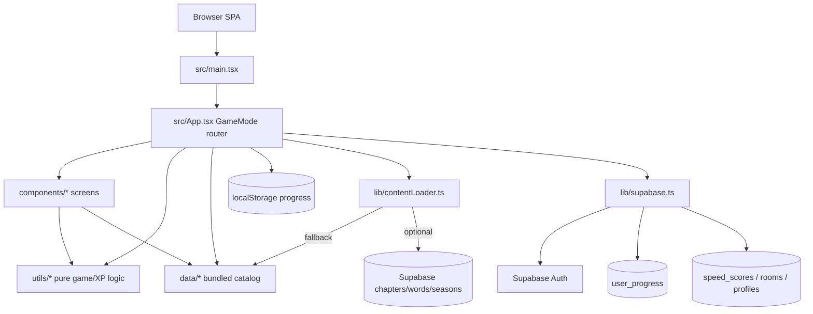

# Codebase Map — Last Day Words
Created: 2026-07-09 · Last verified: 2026-07-09 · Confidence: High (client SPA); Medium (remote Supabase live schema)

## 0 · Snapshot
| Field | Value |
|---|---|
| Purpose (one line) | SDA prophetic hangman/word-study game: chapters, daily streak, speed, XP/ranks, social rooms |
| Primary language(s) / framework(s) | TypeScript · React 19 · Vite 6 · Tailwind 4 |
| Repo shape | monolith SPA (single Vite app) |
| Entry points (count) | 1 browser entry (`src/main.tsx`); no workers/CLI |
| Persistence | `localStorage` (guest + cache) · Supabase Postgres/Auth (signed-in + catalog) |
| Deploy target | Static SPA + PWA (Vite build → `dist/`); Cloudflare Pages assumed in product history; not wired in-repo CI |

**One-paragraph summary:** Last Day Words is a client-only React puzzle game for studying end-time prophetic terms (80 words / 20 chapters). Almost all game state lives in `App.tsx` and `UserProgress` (localStorage key `last_day_words_progress_v1`); Supabase is optional for auth, leaderboards, online rooms, remote content, and XP sync. Before changing anything, treat `App.tsx` as the router and progress orchestrator, and `src/data/words.ts` as the offline source of truth for content.

---

## 1 · Purpose & context

**Problem solved:** Retention-oriented prophetic word study (hangman-style reveal) with streaks, mastery scripture unlocks, speed arcade, local/online teams, and rank cosmetics.  
**Users:** SDA youth / personal study players; optional signed-in accounts for leaderboards and room codes.  
**In scope (verified in code):** Chapter runs, daily challenge, spaced review, speed round, teams local + online rooms, study guide, badges/ranks/cosmetics, Word of the Week, Daniel/Revelation seasons.  
**Out of scope (not in code):** Full live match multiplayer play-by-play, paywalled cosmetics, Gemini AI gameplay (despite README/metadata claims).

**Receipts:**
- Product name/description: `metadata.json:2-4`
- Modes enum: `src/types.ts:4-16`
- README is **AI Studio boilerplate** and does **not** describe the game (`README.md:1-20`) — treat as hypothesis only

---

## 2 · Tech stack
| Layer | Technology | Version | Receipt |
|---|---|---|---|
| Language | TypeScript | ~5.8.2 | `package.json:36` |
| UI | React | ^19.0.1 | `package.json:23` |
| Build | Vite | ^6.2.3 | `package.json:25` / `vite.config.ts:5` |
| CSS | Tailwind via `@tailwindcss/vite` | ^4.1.14 | `package.json:17`, `vite.config.ts:1` |
| Animation | motion | ^12.23.24 | `package.json:22` |
| Icons | lucide-react | ^0.546.0 | `package.json:21` |
| Backend BaaS | `@supabase/supabase-js` | ^2.110.1 | `package.json:16`, `src/lib/supabase.ts:1-16` |
| PWA | vite-plugin-pwa | ^1.3.0 | `package.json:38`, `vite.config.ts:12-35` |
| Database | Supabase Postgres (schema in repo) | n/a | `supabase/schema.sql` |
| Testing | **None configured** | — | no `test` script in `package.json:6-12`; no `*.test.*` under `src/` |
| Lint typecheck | `tsc --noEmit` as `npm run lint` | — | `package.json:11` |
| Dead deps | `@google/genai`, `express`, `dotenv` | present | `package.json:15,19,20` — **zero imports under `src/`** (grep 2026-07-09) |

---

## 3 · Architecture overview



**Style & key patterns:**
- **Single-page mode machine:** `GameMode` string union drives which screen renders (`src/types.ts:4-16`, `src/App.tsx:535-655`).
- **Fat root container:** `App.tsx` owns progress, content load, XP awards, mode flags, and child callbacks (~637 lines).
- **Bundled-first content:** `src/data/words.ts` always ships; Supabase catalog is enhancement (`src/lib/contentLoader.ts:60-84`).
- **Progress dual-write:** every `saveProgress` → localStorage + best-effort `user_progress` upsert when session exists (`src/App.tsx:117-128`, `99-115`).
- **Pure helpers** for scoring/streaks/XP in `src/utils/*` and `src/data/ranks.ts`.

**Where the pattern is violated:**
- `gameLogic.getChapterForWord` / default `allWordsList` still read **static** bundled exports (`src/utils/gameLogic.ts:1`, `:41-42`, `:104`) while gameplay content can come from loaded `chaptersData` state — speed/review helpers accept list args in some places, not all.
- README/metadata claim Gemini server capability; app is offline-first SPA with no GenAI path.
- `package.json` name remains `react-example` (`package.json:2`).

---

## 4 · Directory structure
| Path | Responsibility (verified by looking inside) | Notes |
|---|---|---|
| `/src/main.tsx` | React root mount | `StrictMode` |
| `/src/App.tsx` | Mode router + progress orchestration | Center of gravity |
| `/src/types.ts` | Shared TS types (`UserProgress`, `GameMode`, seasons) | |
| `/src/index.css` | Global parchment/candle theme | |
| `/src/components/` | Screen + gameplay UI | One file per mode-ish |
| `/src/data/` | Bundled content + rank/cosmetic constants | `words.ts` largest file |
| `/src/utils/` | Pure game math, streaks, XP, daily, rewards, notifications | |
| `/src/lib/` | Supabase client + content loader | |
| `/supabase/` | `schema.sql`, `seed_content.sql`, CLI config | Apply manually to project |
| `/scripts/` | `generate-seed.ts` → seed SQL | |
| `/public/` | PWA icons | |
| `/dist/` | Build output | generated |
| `/docs/` | Living map (`CODEBASE.md`) | this file |
| `/RESEARCH_LOG.md` | Citation ledger for study content | not runtime |
| `/.wrangler/` | present on disk | no `wrangler.toml` in repo root (2026-07-09 listing) |

---

## 5 · Entry points & core modules

| Entry point | Location | What it starts |
|---|---|---|
| Browser SPA | `src/main.tsx:6-9` | Renders `<App />` into `#root` |
| Dev server | `package.json:7` `vite --port=3000` | Local HMR |
| Production assets | `npm run build` → `dist/` | Static hosting + SW |

**Core modules** (size + fan-in + orchestration):
| Module | Location | Responsibility | Depended on by |
|---|---|---|---|
| App shell | `src/App.tsx` | Modes, progress save/load, XP hooks, content state | `main.tsx` only entry; owns all screens |
| Word catalog | `src/data/words.ts` (~828 lines) | 20 chapters / 80 terms bundled | App, gameLogic, rewards, contentLoader fallback |
| Study passages | `src/data/studyContent.ts` (~596 lines) | Mastery/fragment/bonus quotes | App, ChapterSelect, VerseLinkBonus |
| Game rules | `src/utils/gameLogic.ts` | Stars, mastery %, review, hints, difficulty | Most game components |
| Progression | `src/utils/progression.ts` + `src/data/ranks.ts` + `cosmetics.ts` | XP awards, rank, cosmetic unlock/merge | App, Dashboard, Badges |
| Content loader | `src/lib/contentLoader.ts` | Fetch catalog/WOTW or bundle | App mount effect |
| Supabase | `src/lib/supabase.ts` | Client, progress fetch/upsert | App, Auth, Leaderboard, OnlineTeams |
| Streaks | `src/utils/streaks.ts` | Daily streak, freezes, ISO week, badges | App, Dashboard, Share |
| Word reveal UI | `src/components/WordRevealGame.tsx` | Chapter hangman session | App gameplay mode |
| Dashboard | `src/components/Dashboard.tsx` | Home: rank, WOTW, modes | App menu mode |

**Largest sources (line counts, 2026-07-09):**  
`words.ts` 828 · `App.tsx` 637 · `studyContent.ts` 596 · `Dashboard.tsx` 439 · `SpeedRoundGame.tsx` 365 · `TeamsModeGame.tsx` 357 · `WordRevealGame.tsx` 289

---

## 6 · Traced flows

### Flow: Cold start → home menu
```
[entry]     src/main.tsx:6-9  createRoot → <App />
  → [state] src/App.tsx:62-90  progress, currentMode="menu", chapters=bundled
  → [load]  src/App.tsx ~useEffect localStorage LOCAL_STORAGE_KEY
            → reconcileStreakOnLoad + unlockCosmeticsForXp
  → [load]  src/App.tsx ~useEffect loadContent()
            → src/lib/contentLoader.ts:63-84
               if no Supabase / empty tables → bundled 80/20 + WOTW seed
               else map chapters/words/seasons/featured
  → [auth]  src/App.tsx ~useEffect supabase.auth + mergeProgression / upsert
  → [UI]    currentMode === "menu" → Dashboard (src/App.tsx:535+)
async: content + auth merge. errors: localStorage try/catch; content catch → bundle.
```

### Flow: Chapter word solve → progress + XP
```
[UI]     WordRevealGame onSolveComplete
  → [App] handleWordSolveComplete (src/App.tsx:269-307)
          calcStars, optional perfect bonus/fragment pick, mastery preview
          (UI modal state only — not yet persisted)
  → [UI]  VerseLinkBonusModal onNext
  → [App] handleProceedAfterSolve (src/App.tsx:309-410)
          recordWordAttempt, solvedWordIds, chapter stars if full run
          if 3★: awardPerfectWordXp (utils/progression.ts)
          if daily run complete: applyDailyStreakComplete + awardDailyCompleteXp
          saveProgress → localStorage + upsertUserProgress (if signed in)
  → mode: next word or chapter-select / menu
async boundaries: remote upsert fire-and-forget in saveProgress.
errors swallowed: console.error on LS/sync failures.
```

### Flow: Daily challenge
```
Dashboard onStartDailyChallenge
  → handleStartDailyChallenge (App.tsx ~248+) sets isDailyMode, gameplay
  → activeChapterObj = buildDailyChapter(allWordsList, todayKey)
    (utils/dailyChallenge.ts)
  → same solve path; on finish: streak + +50 XP (App.tsx:379-381)
```

### Flow: Speed round end
```
SpeedRoundGame onGameFinished(score, count)
  → handleSpeedRoundFinished (App.tsx:412-440)
  → awardSpeedXp floor(score/10)
  → saveProgress
  → optional speed_scores upsert (week_key = getIsoWeekKey)
```

### Flow: Study guide open XP (once/day)
```
header / Dashboard onViewStudyGuide
  → handleViewStudyGuide (App.tsx:443-447)
  → awardStudyGuideXp (+10 if studyGuideXpDate !== today)
  → mode "stats-help" → AboutStudyGuide
```

### Flow: Auth + progress merge
```
AuthScreen sign-in/up (components/AuthScreen.tsx) → profiles
  → App onAuthStateChange → fetchUserProgress
  → mergeProgression max(local.xp, remote.xp) + union unlocks
  → write local + upsert remote
```

---

## 7 · Data model & persistence

### Client `UserProgress` (`src/types.ts:34-76`)
| Field group | Key fields | Storage |
|---|---|---|
| Completion | `solvedWordIds`, `chapterStars`, `wordStats` | localStorage |
| Streak | `dailyChallengeStreak`, `lastStreakDate`, `streakFreezes`, badges | localStorage |
| Rewards | `fragmentIds`, `masteryUnlocks`, daily bonus ids | localStorage |
| Progression | `xp`, `rank`, `unlockedCosmetics`, `selectedCandle/Banner` | localStorage + `user_progress` |
| Prefs | `soundEnabled`, `notificationsEnabled`, `displayName` | localStorage |

**Key:** `last_day_words_progress_v1` (`src/App.tsx:40`)

### Bundled content
| Entity | Shape | Defined at |
|---|---|---|
| Chapter | id, title, description, words[], optional seasonId | `src/data/words.ts` |
| WordTerm | id, word, clue, expertClue?, verse, scripture, summary | same |
| Season | id, title, chapterIds[] | `src/data/seasons.ts` |
| StudyPassage | id, source, citation, text, locator | `src/data/studyContent.ts` |
| Rank | id, title, minXp | `src/data/ranks.ts:18-24` |
| Cosmetic | id, kind, unlockRank, styleToken | `src/data/cosmetics.ts` |

**Catalog size (command 2026-07-09):** 20 chapter ids · 80 word ids in `src/data/words.ts`.

### Supabase tables (`supabase/schema.sql`)
| Entity | Purpose | RLS summary |
|---|---|---|
| `profiles` | display names | public read; own insert/update |
| `speed_scores` | weekly leaderboard | public read; own write |
| `daily_scores` | daily scores | public read; own write |
| `game_rooms` / `room_members` | online room codes | authenticated; host/member update |
| `seasons` / `chapters` / `words` / `season_chapters` | content catalog | public read |
| `content_featured` | WOTW override by week_key | public read |
| `user_progress` | xp/rank/cosmetics | own select/insert/update only |

**Migrations / apply:** no automated migration runner in app. Human applies `supabase/schema.sql` then `supabase/seed_content.sql` (regenerate via `npx tsx scripts/generate-seed.ts`). Project ref in schema header: `haoghddjcstxanrtggvb`.

**Open:** whether production project currently has content tables seeded — SPA falls back if not (`contentLoader.ts:82-84`). Mark remote schema verification **Medium**.

---

## 8 · Interfaces & integrations

**Public interfaces:**
| Interface | Type | Description | Auth | Defined at |
|---|---|---|---|---|
| Static SPA | Web | Game UI | none for play | Vite `dist/` |
| PWA | Web manifest + SW | Installable offline shell | none | `vite.config.ts:12-35` |
| Supabase REST | BaaS tables | content + scores + rooms + progress | anon key + user JWT | client usage across `lib/` + screens |
| Supabase Auth | email/password (via JS client) | account | session | `AuthScreen.tsx` |

**External services:**
| Service | Purpose | Criticality | Called from |
|---|---|---|---|
| Supabase Auth/DB | social, sync, optional content | 🟡 optional for core play | `src/lib/supabase.ts`, App, Auth, Leaderboard, OnlineTeams, contentLoader |
| Web Notifications | streak-at-risk | 🟢 optional | `src/utils/notifications.ts` |
| Gemini API | claimed in README/metadata | 🟢 unused | **no `src` references** |

---

## 9 · Configuration & environments
| Variable / setting | Purpose | Required | Default | Read at |
|---|---|---|---|---|
| `VITE_SUPABASE_URL` | Supabase project URL | for social/sync | undefined → offline | `src/lib/supabase.ts:3` |
| `VITE_SUPABASE_ANON_KEY` | anon key | for social/sync | undefined → offline | `src/lib/supabase.ts:4` |
| `DISABLE_HMR` | disable Vite HMR | no | HMR on | `vite.config.ts:43-44` |
| `GEMINI_API_KEY` | documented in README | **not read by app** | — | README only (hypothesis) |

**Documented example:** `.env.example` (Supabase only).  
**Environments:** single SPA build; no staging config in repo. Host env must inject Vite `VITE_*` at build time.

---

## 10 · Build, run & test — commands that actually ran

```bash
# typecheck (2026-07-09)
npm run lint
# → tsc --noEmit ; EXIT 0

# production build (2026-07-09)
npm run build
# → vite build success ~6.6s
# → dist/assets/index-*.js ~778 kB (gzip ~225 kB)
# → PWA generateSW precache 7 entries (~812 KiB)
# → warning: chunk > 500 kB

# catalog counts (2026-07-09 PowerShell Select-String on words.ts)
# chapters: 20
# words: 80

# tests
# no npm test script; no unit/e2e suite executed (none present)
```

**Local run (from package scripts, not re-probed long-running this session):**  
`npm install` · set `.env` Supabase vars optional · `npm run dev` → port 3000.

**CI/CD:** no `.github/workflows` present in workspace listing (2026-07-09). Deploy path is “build static `dist/` + host (e.g. Cloudflare Pages)” per product history — not codified in this repo’s CI files.

---

## 11 · Quality, risks & tech debt
| Observation | Area | Severity | Receipt |
|---|---|---|---|
| No automated tests | testing | 🔴 | `package.json` scripts; no test files |
| `App.tsx` god-object (~637 lines) | maintainability | 🟡 | size ranking; all modes/progress here |
| Dual content sources can diverge (static helpers vs loaded chapters) | correctness | 🟡 | `gameLogic.ts` imports bundled `allWordsList`; App may use remote chapters |
| Dead Gemini/express deps + stale README | docs/deps | 🟡 | `package.json` + grep no src usage; `README.md` vs `metadata.json` |
| Large single JS chunk (~778 kB) | perf | 🟡 | build output warning |
| Remote schema/seed may not be applied | ops | 🟡 | contentLoader fallback; MCP apply not verified live |
| RLS present in schema for progress/rooms | security | 🟢 | `supabase/schema.sql` policies |
| Citation discipline for study text | content integrity | 🟢 | `RESEARCH_LOG.md` + studyContent locators |
| Streak badge “Faithful Watchman” vs rank “Watchman” | domain naming | 🟢 intentional | `streaks.ts` vs `ranks.ts` |

**Strengths:**  
- Offline-first play always works with bundled 80/20.  
- XP/rank math is pure and unit-testable (`progression.ts`, `ranks.ts`).  
- Schema files + seed generator give a clear ops path.  
- Typecheck + production build green.

**Top risks (ranked):**  
1. **No tests** — progression/solve edge cases regress silently.  
2. **App.tsx concentration** — high blast radius for any feature.  
3. **Content source split** — remote catalog vs helpers still on bundle defaults.

---

## 12 · Onboarding notes

1. **Start at `App.tsx`**, not the README. Modes are a string switch; progress is one big state object.
2. **Content:** edit `src/data/words.ts` (+ expert clues / studyContent / RESEARCH_LOG). Regenerate seed with `npx tsx scripts/generate-seed.ts` if using Supabase catalog.
3. **Progress:** always go through `saveProgress` so localStorage + remote stay aligned.
4. **Supabase is optional.** Missing env or empty tables ≠ broken game; it means guest/offline path.
5. **XP hooks:** daily finish, perfect solve, speed end, study-guide open — see `src/utils/progression.ts` and call sites in `App.tsx`.
6. **Do not invent EGW wording** for study unlocks; use verified ledger patterns in `RESEARCH_LOG.md`.

---

## 13 · Open questions
- [ ] Has `schema.sql` + `seed_content.sql` been applied to live project `haoghddjcstxanrtggvb`? (contentLoader will use bundle until yes)
- [ ] Is Cloudflare Pages the production host, and where is the project config? (`.wrangler` residue; no root wrangler.toml found)
- [ ] Should dead deps (`@google/genai`, `express`) and AI Studio README be removed or is a server path planned?
- [ ] Intended source of truth long-term: always bundle, always Supabase, or hybrid forever?
- [ ] `daily_scores` table exists in schema — which UI paths write/read it end-to-end? (needs dedicated trace if product uses it)
- [ ] Are online teams rooms fully functional under current RLS with multi-client play? (schema hardened in commit `d47e8ea`; runtime not exercised this session)

---

## 14 · Glossary
| Term | Meaning |
|---|---|
| Chapter | Fixed set of 4 prophetic terms played as a run |
| WordTerm | Hangman target string + clue + KJV verse fields |
| GameMode | App screen id (`menu`, `gameplay`, `speed-round`, …) |
| UserProgress | Client progress document (localStorage) |
| Mastery tier | 25 / 50 / 100% chapter star completion unlocks study passage |
| WOTW | Word of the Week — Sabbath/ISO-week seeded term |
| Season / track | Daniel or Revelation chapter grouping |
| Rank | XP ladder: Novice → … → Prophetic Scholar |
| Cosmetic | Free rank-gated candle style or chapter banner |
| Expert Mode | No hints, expert clues, timed Soul Lamp |
| Faithful Watchman | **Streak badge** (30 days), not rank id `watchman` |
| Fragment | Collectible study snippet toward 10-piece bonus |

---

## 15 · Map changelog
| Date | Change | Sections touched |
|---|---|---|
| 2026-07-09 | Initial verified map after XP/ranks/content expansion (80/20, Supabase content tables, progression) | all §§0–14 |

---

### Architecture hypothesis (Phase 1) vs verification

| Hypothesis before deep read | Verdict |
|---|---|
| AI Studio Gemini app per README | **Killed** — no GenAI usage in `src/`; game is hangman SPA |
| Supabase is required | **Partial** — optional; core play offline |
| Thin React shell over API | **Killed** — fat client; API is thin BaaS |
| Content only in Supabase | **Killed** — bundle is fallback and current offline truth |

### Evidence commands log (session)
```
npm run lint          → exit 0
npm run build         → exit 0 (~6.6s)
chapter/word counts   → 20 / 80
git log --oneline -4  → d47e8ea, 9aa884d, f1952cb, 9b9e859
```
